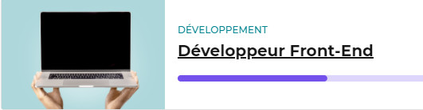
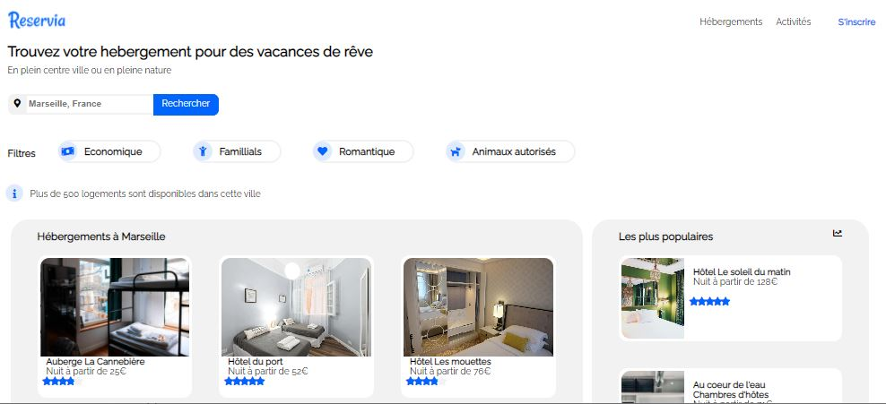
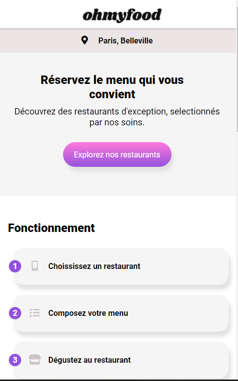

# Bienvenue sur mon portfolio

## **Introduction**

Ce site est le portfolio de mes réalisations dans de cadre de ma reconversion professionnelle Développeur Front-End.

## **Projet Reservia**

### Presentation du projet Reservia

Réalisation de la maquette Reservia avec Visual Studio Code et differents plugins.  
Intégration des icônes Font Awesome.  
Utilisation Flexbox et CSS Grid.  
Le site est compatible avec les dernières versions de Chrome et Firefox.  
Utilisation du plugin git graph.  
Aucune erreur ni alerte au validateur W3C HTML et CSS.  

### Lien html

* [Reservia](https://melaniemdm.github.io/Projet_2_Reservia/Reservia.html)

---
---

## **Projet OhMyFood**

### Presentation du projet OhMyFood

L'objectif est le devellopement en mobile-first qui repertorie les menus de plusieurs retaurants gastronomiques.
Utilisation de vs-code et du plugin Sass.
Intégration des nimations demandés dans le Brief.
Aucune erreur ni alerte au validateur W3C HTML et CSS.

### Lien du projet OhMyFood

* [OhMyFood](https://melaniemdm.github.io/Projet_3_ohmyfood/)

---
---

## **Projet GameOn**

### Presentation du projet GameOn

Le travail consiste à ajouter le code JavaScript manquant pour que le formulaire soit pleinement fonctionnel.  
Corriger les issues ci dessous:  
**TODO_1** : fermer la modale  
**TODO_2**: Implémenter entrées du formulaire  
**TODO_3**: Ajouter validation ou messages d'erreur  
**TODO_4**: Ajouter confirmation quand envoie réussi  

### Lien du projet GameOn

* [GameOn](https://melaniemdm.github.io/GameOn-website-FR/starterOnly/)
